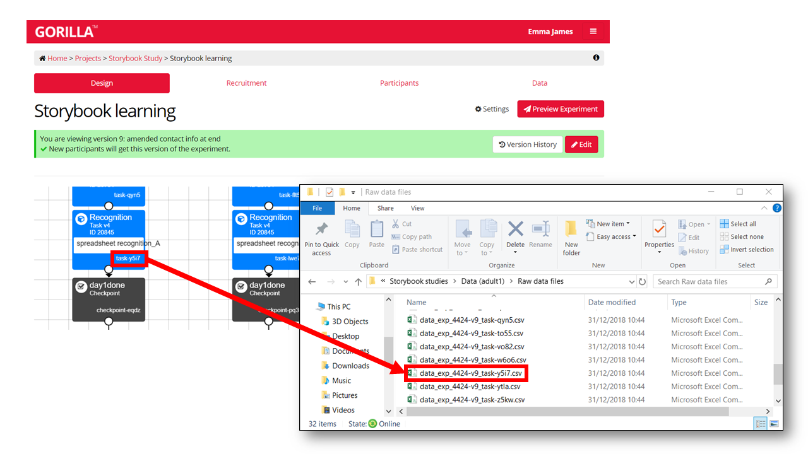
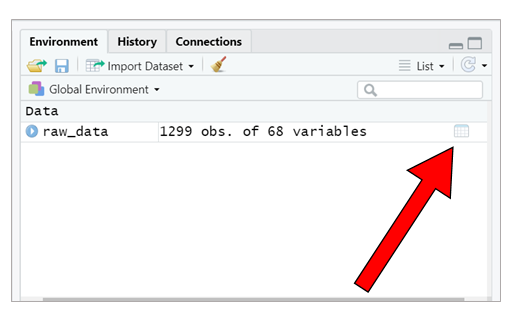
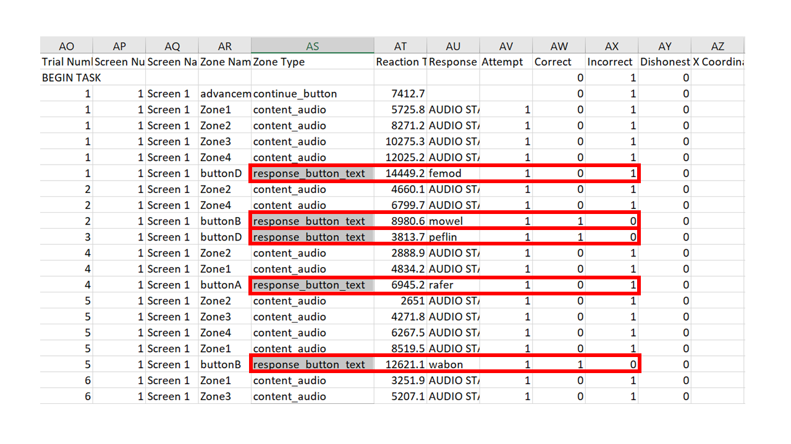

```{r echo = FALSE}
options(Encoding="UTF-8")
```

***********************

# Setting up

### Loading the tidyverse 

If you have not done so already, you will need to install the relevant packages, with the following line of code. You will only need to do this once on your computer (unless you require updates etc.). 

```{r eval = FALSE}
install.packages("tidyverse")
```

Once you have the packages installed, you need to load them into your library. You need to do this at the start of every script, for every time you open R. 

```{r warning = FALSE, message = FALSE}
library(tidyverse)
```

What have we loaded here? By loading the *tidyverse* library, we have actually loaded several packages, including *ggplot2* (the go-to package for plotting in R), *dplyr*, *tidyr*, *readr*, *purrr*, *tibble*, *stringr*, and *forcats*. Each of these packages contains a set of tools that you can draw upon to complete your tasks. We don't actually use all of them here, but loading the core *tidyverse* library is an easy way to make a lot of key functions available. There are also more specialist *tidyverse* packages that you can load in separately (see [here](https://www.tidyverse.org/packages/)) for working with particular kinds of data. 

### Dummy data

This tutorial is a step-by-step example that I hope you can apply to your own data. If you'd like to follow along with my data files, you can download them [here](https://github.com/emljames/GorillaR/blob/master/story_materials.zip).

***********************

# Step 1: Reading in the raw data

In this example, we will use an output file from a word-learning experiment programmed in Gorilla (currently unpublished data, further information available [here](https://osf.io/stx6q/)). Gorilla spits out a different csv file for each task node in the experiment. For now, we will focus on reading in and processing data from a single task file, but we will cover how to combine data from multiple task files in Part 2.

Each csv file from Gorilla is identified by the experiment code and version (the same for all of your output files, unless you had to set up a second version of the experiment), and the task ID at the end (a string of 4 alpha-numeric characters). You can match these up to your experiment by looking at your task builder. 



For this task, the corresponding data file is "data_exp_4424-v9_task-y5i7.csv". We can read it into R using the `read.csv()` function. The assignment operator `<-` means that we store the result as a dataframe in our environment. I have called the dataframe `raw_data`, but you could call it whatever you like. 

```{r}
raw_data <- read.csv("./story_materials/data_exp_4424-v9_task-y5i7.csv")
```


It's a good idea to preview the dataframe to check that things haven't gone awry. The easiest way to do this is to use the viewer in RStudio (unless your dataset is huge). You can open the viewer by double-clicking the little grid icon next to dataframe in the Environment pane.




***********************

# Step 2: Using `filter()` to select data rows

### Identify the data

If you open your csv file (using e.g., Excel), you will see that Gorilla provides you with a row for each screen that a participant sees. Depending on your experiment, this could mean that there are multiple output rows for a single experimental trial. Scroll the columns and try to identify which rows contain the data you need---usually collected from a response zone. If you've been thorough in your Gorilla set-up and named all of your screens thoroughly this might be easy. If you're like me and haven't bothered, you will have lots of rows that are unhelpfully named as "Screen 1", "Screen 2" etc. So look for the rows that contain your response data in some appropriate-looking columns! 



The task we're using here is a 4-alternative-forced-choice task: participants were presented with a picture and were asked to select which of 4 pseudowords was its name in a story they had listened to. The participant could click each item to hear the associated audio files, and Gorilla keeps a record of whether they have done this. As a result, there are varying numbers of rows for each trial. However, each trial ended with the participant pressing a response button to make their selection, and so we can use the `response_button_text` in the Zone Type column to identify each response.

*Note, some experimental software (or your programming of it) will leave you with a single row per trial to start with. If this is the case, you can skip to [Step 3](#step3)!*

### Subset the dataframe

Once you've identified the rows that contain data, you'll want to get rid of the rows you don't need. If you're used to processing your data in Excel, this step is similar to filtering your data in a table; or in SPSS, it's like 'Select Cases'.

Here, we see the pipe operator for the first time, ` %>% `. The pipe takes the information from the left of it, and feeds it into the next function. You can read the pipe in your head as saying *"and then..."*.

We use the `filter()` function to select the rows with our response data. We need to tell it which column to look in (here we can select by Zone Type), and then which values it needs to match. Note that R doesn't like spaces in column names, so it might have read in your column names slightly differently to how you see them when you open them in Excel. You can double check this by inspecting the dataframe within RStudio viewer, or by using the command `names(raw_data)` to print out the column names. 

```{r}
raw_data <- raw_data %>% 
  filter(Zone.Type == "response_button_text")
```

So all in all, we have said here that we want to re-assign (`<-`) the `raw_data` object by: taking the existing `raw_data`; *and then* applying a filter to keep only the rows with `"response_button_text"` in the `Zone.Type` column.

### Check the data look sensible

Now we have narrowed down the dataset, we expect to have one row per trial, per participant. We can check this by counting how many trials we have per participant.

```{r}
raw_data %>%                             
  group_by(Participant.Private.ID) %>%    
  count()             
```

We've introduced two new functions here: `group_by()` and `count()`. This is what we have said:  

* Take the dataframe `raw_data` - *AND THEN...*  
* `group_by` - this means we want R to perform the operation separately for each participant (labelled in the column called `Participant.Private.ID`) - *AND THEN...* 
* `count` - we are asking R to count the number of rows. Because its input is the grouped data by participant (from the row above), it will count the number of rows per participant.

If we have processed the data correctly, the number of rows per participant should match the number of trials that each participant completed in this task. In this task, participants were tested on their memory for 15 different pseudowords that they heard in the story, so this seems to make sense. If the number of rows and trials do not correspond when processing your own data, you should look back at the data and try again.

Note that we haven't used the assignment operator here, so R will just print out the values to the console. If things look odd or you want to explore further, you could assign it to a new dataframe using the `<-`, as we did above.

```{r}
trial_count <- raw_data %>% 
  group_by(Participant.Private.ID) %>% 
  count()
```

You should now see that a new dataframe called `trial_count` has appeared in your RStudio environment window. You can open it in the viewer to explore it manually if you prefer. 

*Note that we use `Participant.Private.ID` here as the anonymised ID provided by Gorilla. If recruiting via Prolific, the `Participant.Public.ID` column will include their Prolific ID, and you may wish to use this initially to check for task compliance/approving submissions.*

***********************

# Step 3: Using `select()` and `rename()` to retain key variables {#step3}

OK, so we've narrowed down the dataset somewhat, but Gorilla has also given us lots of information that---whilst useful---we don't need for our main data analysis. How many columns you have depends on how you have set up your experiment, but you can see we have a lot here by printing out the column names.

```{r}
names(raw_data)
```

### Select key variables

We only need a few of these, so we can select relevant columns by name, using the `select()` function. Again, you might want to peruse your dataset in Excel to help you identify where your data are stored. 

Let's re-assign our columns to a new dataframe, `trial_data`, for storing our processed trial-level data.

```{r}
trial_data <- raw_data %>% 
  select(Participant.Private.ID, ANSWER, Correct, Reaction.Time)
```

Here, we've selected the variables that represent the participant's ID (`Participant.Private.ID`), the correct answer for that trial (`ANSWER`), whether the participant selected the correct answer (`Correct`), and how long it took them to make the decision (`Reaction.Time`). 

This is just like the process of copying/pasting relevant data in other software, except we are never deleting any data, and it's instantaneous to re-run the data extraction if we realise we want to do something differently. 

### Rename your variables

Some of the column names are not very informative for our purposes, or are a bit long. 

If you don't have many columns and want to rename everything, you can use the `set_names()` function. There are multiple columns to rename, so we have to give `set_names()` a *list* of column names. To do that, we need to wrap our chosen names inside the `c()` function to combine them. Without the `c()` function, `set_names()` would try to interpret each of the words as a separate argument, rather than reading them altogether as your chosen names. 

```{r eval = FALSE}
trial_data <- trial_data %>% 
  set_names(c("ID", "item", "acc", "RT"))
```

Using `set_names()` will rename each column in order, so check that you get this right! 

Alternatively, if you just want to rename one or two of the variables, you can use the `rename()` function to map each old name to a new name. This method involves more typing, but is less error-prone if you find yourself adding more columns later down the line, and/or they end up in a different order. More laborious, but more fool-proof! 

```{r}
trial_data <- trial_data %>% 
  rename(ID = Participant.Private.ID,
         item = ANSWER,
         acc = Correct,
         RT = Reaction.Time)
```

Note that for each column, we have used `new_name = old_name` to assign the changes within the `rename()` function, and separated each pair by a comma. 

### Check the data look sensible

Again, we can carry out quick checks to make sure we've not done anything stupid. Here, we can just print out the first few rows of the dataframe to check that the column names and data look as we want. The `head()` function lets us do this easily. 

```{r}
head(trial_data)
```

***********************

# Step 4: Computing participant-level averages using `summarise()`

### Compute a mean score for each participant

For some types of analyses, we will want to use just one score per participant, averaged across all trials. Now we have our tidied and processed trial-level data, we can use `summarise()` to calculate participant means. Because we want one score per participant, we pass it through the `group_by()` function first, as we did when we counted trial numbers earlier.

```{r}
participant_data <- trial_data %>% 
  group_by(ID) %>% 
  summarise(meanAcc = mean(acc), 
            meanRT = mean(RT, na.rm = TRUE))
```

This can be read as follows:  

* Create the output `participant_data` by...    
* Taking the `trial_data` dataframe, *AND THEN...*  
* Grouping by each participant `ID`, *AND THEN...*
* Computing some summary data: we use the format `column_name = operation` to compute each statistic, with each set separated by a comma. We create a column called `meanAcc` by calculating a mean of the participant's accuracy data (`mean(acc)`), and a column called `meanRT` by calculating the mean of the RT data. By stating `na.rm = TRUE` within the `mean()` function, we tell R to ignore rows with missing data. If you have missing data and don't specify this, R will return `NA` for the mean as a result.

*(Note, the RT data is actually not useful for this experiment, but included for demonstration purposes)*

### Check the data look sensible

Again, let's check that we have a sensible output, by printing the top of the dataframe.

```{r}
head(participant_data)
```

You can see now that we have just one accuracy score and one RT score for each participant ID. If this is your first time processing your data, you could also check this manually on one or two participants to check the data are as you expect. 

***********************

# Step 5: Saving the processed data

Now we have our trial level and participant level data, we can save these out as processed csv files. Doing so means that you won't have to do your data processing at the start of each analysis script (you can read in the processed files directly), and you can more readily share these files on the Open Science Framework.

To write out the data, we use the `write.csv()` function. We need to tell it the dataframe we want to save and the name we want to give it (*including* the file extension, *.csv*). Here, we have also included `row.names = FALSE` to stop R from automatically adding a column with row numbers. 

```{r eval = FALSE}
write.csv(trial_data, "./output/trial_data.csv", row.names = FALSE)
write.csv(participant_data, "./output/participant_averages.csv", row.names = FALSE)
```

I've also include `"./output/"` at the start of my file name, to save the files to the "output" folder in my working directory.  

***********************

# Summary

### Recap

I hope you have seen that the *tidyverse* tools can be helpful in efficiently processing new datasets. In this example, we used the following functions to process our data:  

* `read.csv()` to read in the data.
* `filter()` to keep one row per trial, containing the participant response.
* `select()` to keep the relevant columns.
* `set_names()` or `rename()` to name the columns in a more intuitive way. 
* `group_by()` and `summarise()` to calculate summary statistics for each participant. These are also useful when producing descriptive statistics across the whole sample.

We also used `head()` and `count()` to keep checking that our data processing looked sensible.

### Putting it all together (in one easy step!)

Throughout this example, we have broken down the processing steps to learn what each function does. However, the joy of the *tidyverse* and the pipe operator is that we can actually do this all in one fell swoop. Whilst it makes sense to build up your data processing bit by bit and carry out checks along the way, the final product can be much shorter. 

```{r}
processed_data <- read.csv("./story_materials/data_exp_4424-v9_task-y5i7.csv") %>% 
  filter(Zone.Type == "response_button_text") %>%
  select(Participant.Private.ID, ANSWER, Correct, Reaction.Time) %>% 
  set_names(c("ID", "item", "acc", "RT")) %>% 
  group_by(ID) %>% 
  summarise(meanAcc = mean(acc), meanRT = mean(RT, na.rm = TRUE))
```

And that's it! From experiment output to cleaned processed data in just 6 lines of code and a few seconds (or 4 lines if you want to stick with trial level data). By scripting your data processing in this way, it will help to keep on top of data as it comes in---you can re-run the script on your most recent data file in no time at all.

### Onwards to Part 2...

In Part 2 of this tutorial, we will learn how to use these tools when working with more complex datasets: those with more conditions, and those that need combining across several files or perhaps even several tasks. We'll also cover how to build in an eligibility check for keeping track of your sample size as it comes in, and how to re-arrange your data for different purposes.

Ready? [Let's go!](https://emljames.github.io/GorillaR/GorillaR_Part2.html)
